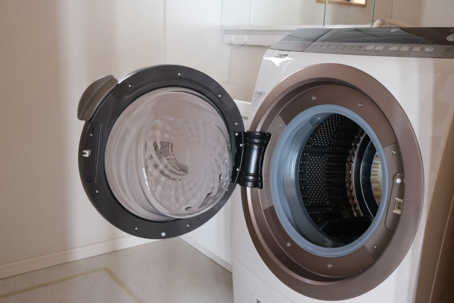

<!-- ============================================================
  記事番号: 03（R-02）／slug: 03-sentakuki-kansouki-erabikata
  配置先: articles/03-sentakuki-kansouki-erabikata/
  このmdが編集用ソース（正本）。同フォルダの index.html はこのmdから生成する生成物（直接編集しない／R-09）。

  ▼メタ情報（R-06：ページの <title> / description に設定）
  title: 洗濯機と乾燥機の選び方｜縦型・ドラム式・乾燥機を後悔なく選ぶ｜おはぎの二世帯ぐらし
  description: 洗濯機（縦型・ドラム式）と乾燥方式（一体型・電気乾燥機・ガス・部屋干し）の選び方を中立に解説。賃貸・分譲マンション・買い替え・新築まで、設置・搬入・容量・電源のチェックポイントを整理。完全分離二世帯ならではの注意点も。

  ▼Claude Code への作業指示
  - このmdを articles/03-sentakuki-kansouki-erabikata/03-sentakuki-kansouki-erabikata.md に配置し、同フォルダに index.html を生成（R-09 ステップ2）。
  - 記事トップの並びは サムネ→タイトル→リード→広告開示 を維持（R-01）。
  - <title>/description は上記メタ情報を個別設定（R-06）。
  - 変換後ローカルで表示確認 → 人が最終チェック（R-07）→ コミット → push（R-08／R-09。公開操作は人）。

  ▼公開前TODO（差し替え対応表 internal/affiliate_link_map.md を正とする）
  1. サムネイル：下の「サムネイル画像URL」を実URLに差し替え（altは設定済み・必要なら調整）。
  2. 内部リンク2か所の (内部リンク) を実スラッグへ：
     - リード文／まとめの「縦型洗濯機＋電気乾燥機を選んだ理由」→ 02-tategata-sentakuki-denki-kansouki（体験記事）
     - 二世帯セクションの「完全分離型二世帯住宅とは」→ 01-kanzenbunri-nisetai-towa（別記事）
  3. (アフィリエイトリンク) を実リンクに差し替え（承認前は楽天単体で先行公開も可）。
  4. 維持すること：冒頭の広告開示文（R-05）／固定価格を書かない（R-03）／作業用コメントを残さない。
============================================================ -->

# 洗濯機と乾燥機の選び方｜縦型・ドラム式・乾燥機を後悔なく選ぶチェックポイント

洗濯機と乾燥機は、一度購入したら毎日・何年も使うもの。それなのに、いざ選ぶとなると種類も多くて迷いがちです。この記事では、縦型かドラム式か、乾燥はどうするか、設置・搬入で見ておくことを整理し、最後に新築・二世帯ならではの注意点についてもお伝えしています。今使っているものが古くなって買い替えを検討している方も、新築に向けて一新したい方も、自分に合う洗濯スタイルを見つける材料としてご覧ください。

> **広告について**：本記事はアフィリエイト広告（Amazonアソシエイト等）を利用しています。紹介する商品リンク経由で購入された場合、運営者に収益が発生することがあります。価格・在庫は変動するため、購入前に各販売ページで最新情報をご確認ください。

> 「結局ohagiは何を選んだの？」という具体的な体験談は別記事（[縦型洗濯機＋電気乾燥機を選んだ理由](内部リンク)）にまとめています。

## 洗濯機の2タイプ — 縦型とドラム式

洗濯機は大きく**縦型**と**ドラム式**に分かれます。暮らし方との相性で選ぶとしっくりきやすいです。

### 縦型（たて型）
上から洗濯物を入れ、水を多めに使って"もみ洗い"するタイプ。

- 向いている人：**洗浄力（とくに泥汚れ・皮脂汚れ）を重視**したい／**初期費用を抑えたい**／本体をコンパクトにしたい。
- 注意点：乾燥機能付きモデルもあるが、ドラム式に比べると乾燥は不得手な傾向。乾燥を本格的に使うなら、別置きの乾燥機との組み合わせが現実的。

### ドラム式
横向きのドラムを回し、少ない水で"たたき洗い"するタイプ。乾燥まで一台で完結できる。

- 向いている人：**洗濯〜乾燥を全自動でまかせたい**／**節水したい**／干す手間を減らしたい。
- 注意点：本体が大きく重い。**搬入経路と設置スペースの確認が必須**。初期費用は縦型より高めの傾向。

### ざっくり比較

| 項目 | 縦型 | ドラム式 |
|---|---|---|
| 洗浄力 | 得意（もみ洗い） | 標準〜得意 |
| 乾燥 | 苦手〜標準 | 得意 |
| 水の使用量 | 多め | 少なめ |
| 本体サイズ | コンパクト寄り | 大きい・重い |
| 初期費用の傾向 | 抑えめ | 高め |
| 向いている人 | 洗浄力・コスト重視 | 時短・乾燥重視 |

※あくまで一般的な傾向です。モデルによって能力差があるので、最終的には各メーカーの仕様で確認を。

## 乾燥の手段はさまざま

乾燥は、乾燥機能付き洗濯機以外の方法もいくつかあります。選択肢を一通り知っておくと、「我が家にはこっちが合いそう」と見比べやすくなります。

### ① 洗濯機の乾燥機能（一体型）
ドラム式や乾燥付き縦型の機能を使う方法。**動線が最短**（入れて回せば終わり）が最大の利点。一台で完結したい人向け。

### ② 電気衣類乾燥機
洗濯機の上などに据える独立した乾燥機。**洗濯機は洗浄重視（縦型など）、乾燥は乾燥機にまかせる**という分業ができる。洗濯と乾燥を同時並行できるので、洗濯物の量が多い家庭はむしろ時短になることも。

### ③ ガス衣類乾燥機
ガスの熱で一気に乾かすタイプ。**乾燥スピードとふんわり感が強み**。ただし**専用のガス栓が必要**。新築・リフォームなら設計段階で計画しやすく、賃貸・既存住宅では「ガス栓のある場所に置けるか」が前提になる点をチェック。

### ④ 部屋干し＋サーキュレーター・除湿機
機械乾燥を使わない・補助する選択。花粉や天候に左右されず、電気代を抑えたい人に。**ランドリースペース＋除湿機＋送風**の組み合わせが定番。

- 便利グッズ：[衣類乾燥除湿機](アフィリエイトリンク)、[サーキュレーター（首振り・静音）](アフィリエイトリンク)、[昇降式・室内物干し](アフィリエイトリンク)

## 買う前に見ておきたいチェックポイント

賃貸でも持ち家でも、つまずきやすいのが設置まわり。**採寸と経路**を先におさえておくと、その後の機種選びがぐっとラクになります。

1. **設置スペースの寸法**：防水パンのサイズ、蛇口（水栓）の高さ、左右と背面のすき間（壁との余裕）。とくにドラム式は扉の開閉スペースも必要。
2. **搬入経路の幅**：玄関ドア・廊下・曲がり角・階段の幅。特に大型のドラム式は、ここで「入らなかった」となりやすいので要注意です。
3. **容量の目安**：1人あたり約1.5kgの洗濯物が出るのが目安。2人なら7kg前後、3〜4人なら8〜10kg前後を一つの基準にすると良いでしょう。
4. **電源・アンペア・アース**：乾燥機やドラム式は消費電力が大きめ。専用コンセント・アースの有無を確認しましょう。新築・リフォームなら導入を見越した設計が必要です。
5. **ガス栓の有無**：ガス乾燥機を導入する場合は、設置場所にガス栓が必須。新築・リフォームなら設計段階で忘れずに計画しましょう。既存住宅でも工事することで導入できる場合もあるので、業者に確認してみましょう。
6. **給排水と防水パン**：排水口の位置・防水パンの内寸によっては設置が難しいことも。あらかじめ確認しておきましょう。新築の場合は、機種の目星をつけておくとスムーズです。

- 便利グッズ：[ランドリーラック（洗濯機上の空間活用）](アフィリエイトリンク)、[かさ上げ用の防振ゴム／洗濯機台](アフィリエイトリンク)

## 完全分離の二世帯ならではの注意点

二世帯・新築を考えている方向けのポイントです。完全分離型は各世帯に洗濯設備が1セットずつになるため、単世帯にはない注意点があります。

- **光熱費・費用分担**：乾燥機は電気やガスを多く使うので、メーターを世帯別に分けるのか、まとめて按分するのかを、入居前に決めておくと後々もめにくい。
- **同時使用と電源・容量**：両世帯が同じ時間帯に洗濯・乾燥を回すと、電源容量が足りなくなることも。アンペア契約や運転時間帯への配慮があると安心。
- **設置と騒音**：上下階・寝室との位置関係に要注意。夜間に運転することが多いなら、静音性と設置場所には特に気を付けましょう。

> 完全分離型二世帯住宅そのものについては、別記事（[完全分離型二世帯住宅とは](内部リンク)）も合わせてどうぞ。

## タイプ別・おすすめの組み合わせ

迷ったときは、自分がいちばん譲れない軸から考えると選びやすくなります。

- **とにかく時短・干す手間ゼロにしたい** → ドラム式
- **洗浄力とコストを重視しつつ、乾燥も欲しい** → 縦型＋電気乾燥機
- **毎日大量に洗濯・乾燥をする（育児・部活など）** → より乾燥の早いガス乾燥機
- **スペース・予算が限られる** → 縦型＋部屋干し＋[衣類乾燥除湿機](アフィリエイトリンク)

## よくある質問

**Q. 新居用の洗濯機は引っ越し前に買っておくべき？**
A. **設置場所の採寸が終わってから**だと安心です。防水パンの内寸・蛇口高さ・搬入経路が分かる前に大型機を買うと、「入らない・置けない」こともあります。新築なら図面段階で候補機種の当たりをつけ、寸法が固まってから発注すると安全です。

**Q. 賃貸でもドラム式は置ける？**
A. 置けることは多いですが、**搬入経路と防水パンの内寸**しだいです。とくに古い物件は防水パンが小さめで、大型のドラム式が載らないことも。内見や下見のときにサイズを測っておくと安心です。

**Q. 結局、縦型とドラム式はどっちが正解？**
A. 用途次第です。**洗浄力・コスト重視なら縦型、時短・乾燥重視ならドラム式**が大まかな目安。自分が譲れない軸を基準に選ぶのがコツです。

**Q. ガス乾燥機は新築じゃないと無理？**
A. 後付け工事が可能な場合もありますが、業者とよく相談が必要です。**新築なら設計段階でガス栓と設置場所を確保しておくほうが圧倒的にラク**です。少しでも検討するなら、図面の段階で相談を。

**Q. 乾燥機を使うと電気代はどのくらいかかる？**
A. 機種や乾燥方式、運転時間によって変わります。ヒートポンプ式は消費電力が抑えめ、ヒーター式は乾きは早い反面、電気代がかさみやすい傾向。少しでも抑えたいなら、まとめ洗いで運転回数を減らす、洗濯でしっかり脱水してから乾燥に回す、といった工夫が効きます。具体的な料金は契約プランや使い方で大きく変わるので、各メーカーの目安や電力会社の単価で試算してみると安心です。

## まとめ

洗濯機・乾燥機選びは、**①縦型かドラム式か（洗浄重視か乾燥重視か）→ ②乾燥をどの方式でまかなうか → ③設置・搬入・電源・ガス栓を確認**、という順で見ていくと整理しやすいです。賃貸・買い替えなら今ある設置場所・電源・搬入経路を起点に、新築・二世帯なら設計段階で設置・電源・ガス栓まで含めて考えると、自分の住まいに合う一台を選びやすくなります。

メリット・デメリットを並べてきましたが、「実際に我が家はどうしたか」は体験記事（[縦型洗濯機＋電気乾燥機を選んだ理由](内部リンク)）に。読み比べると、自分の家に合う答えが見えてきます。

---
*※価格・仕様は記事作成時点のものです。最新情報は各販売ページでご確認ください。*
