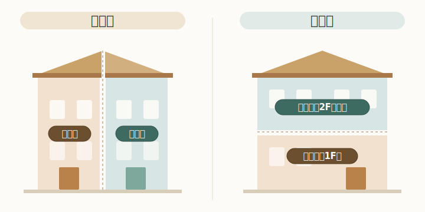

<!--
@title: 完全分離二世帯は縦割り？横割り？間取りと費用感を比較
@description: 完全分離型の二世帯住宅を「縦割り」でつくると、間取りと費用はどう変わるのか。横割りとの違い、コストが上がりやすい/抑えやすいポイントを、固定価格を出さずに考え方ベースで整理します。
@slug: 04-kanzenbunri-tatewari-yokowari-hikaku
@status: draft
公開前TODO（R-09／HANDOFF 8章チェックリスト準拠）:
  1. サムネイル画像URLを実URLに差し替え（本文のPLACEHOLDER_THUMBNAIL_URL）。altは設定済み。【要・運営者確定】
  2. 内部リンク：01・03の確定スラッグへ差し替え済み（../01-kanzenbunri-nisetai-towa/ ・ ../03-sentakuki-kansouki-erabikata/）。リンク先の表示文言が実記事タイトルと一致するか最終確認。
  3. 本文中の図 tatewari-yokowari.svg を、この .md と同じ articles/04-kanzenbunri-tatewari-yokowari-hikaku/ フォルダに配置する（.md からは相対参照）。
  4. この記事は中立解説のためアフィリンクは原則なし（R-04準拠：体験記述・一人称なし）。
  5. .md → index.html に変換し、ローカル確認（R-09 ステップ2）。03記事と同じCSS/テンプレートを当て、### の番号付き小見出し（①②③）と区切り線、丸数字バッジの見た目を揃える。
  6. R-01の並び（サムネ→タイトル→リード→広告開示）を変換後HTMLでも確認。
  7. 公開はR-09に従い人がpush（R-07の最終チェック後）。
-->

# 完全分離二世帯は縦割り？横割り？間取りと費用感を比較

完全分離型の二世帯住宅を検討すると、まず迷うのが「縦割りか、横割りか」という分け方です。同じ完全分離でも、この選び方で間取りの自由度も費用感も変わってきます。この記事では、縦割りと横割りを比べながら、間取りと費用がどう決まるのかを、考え方ベースで整理します。

> この記事は商品やサービスのアフィリエイト広告を含む場合があります。実際の費用は土地条件・仕様・時期で大きく変わるため、具体的な金額は記載していません。最新の費用は施工会社の見積もりでご確認ください。

## 「縦割り」と「横割り」の違い

完全分離型の二世帯住宅は、住戸の分け方で大きく二つに分かれます。

縦割りは、建物を左右に分けて、それぞれの世帯が1階から上階までを縦に使う方式です。各世帯が独立した「自分の家」に近い感覚で暮らせ、上下階の生活音が世帯間で伝わりにくいのが特徴です。

横割りは、1階を親世帯、2階以上を子世帯、というように階で分ける方式です。1階に親世帯を置けるため、高齢になっても階段を使わずに生活を完結させやすい利点があります。

どちらが正解ということはなく、「世帯間の独立性をどこまで重視するか」「将来の身体的な負担をどう見込むか」で向き不向きが分かれます。

## 縦割りの間取りで押さえるポイント

縦割りは各世帯が縦動線（階段）を持つため、間取りを考えるうえでいくつかのポイントがあります。

### ① 設備と床面積

世帯ごとに玄関・階段・水まわりを一式持つことになります。完全分離である以上これは横割りでも同じですが、縦割りでは**階段が世帯数だけ必要**になり、その分の床面積を見込む必要があります。さらに建物を左右に分けるぶん、各世帯の**1フロアあたりの床面積は狭くなりがち**です。同じフロアに居室・水まわり・階段を収めることになるため、階段位置や水まわりをコンパクトにまとめるなど、間取りの工夫が求められます。

### ② 敷地の使い方

縦割りは建物を左右に並べるため、**間口（道路に面した幅）にある程度の余裕が必要**です。間口が足りないと各世帯の居室が細長くなりがちで、間口が狭い敷地では横割りのほうが計画しやすい場合があります。

### ③ 各世帯の上下移動

縦割りは各世帯が1階から上階までを縦に使うため、**どの世帯も日常的に階段の上り下りが必要**になります。横割りなら親世帯を1階だけで完結させられるのに対し、縦割りでは将来に向けて、1階に寝室や水まわりを置ける間取りにしておく、ホームエレベーターのスペースを見込んでおくといった備えを検討しておくと安心です。

## 横割りの間取りで押さえるポイント

横割りは階で世帯を分けるため、縦割りとは違うポイントがあります。

### ① 上下階の生活音

親世帯の上で子世帯が暮らす形になるため、**足音や水まわりの音が下階に伝わりやすい**点に注意が要ります。床の遮音仕様や、水まわり・寝室の配置を上下でずらす工夫が、計画段階で重要になります。

### ② 階段と動線

横割りでは子世帯が2階以上へ上がる動線をどう取るかがポイントです。**1階の親世帯スペースを通らずに2階へ上がれる**よう、専用の玄関や外階段を設けるかどうかで、独立性と間取りの自由度が変わります。

### ③ 将来の暮らしやすさ

1階に親世帯を置けるため、**高齢になっても階段を使わず生活を完結させやすい**のが横割りの強みです。一方で子世帯は階段の上り下りが日常になるため、世帯ごとの年齢構成や生活スタイルに合うかを見ておく必要があります。

## 費用を左右するポイント

完全分離の二世帯は、設備や動線を二重に持つため、単世帯の住宅より費用がかさみやすい構造です。具体的な金額は土地・仕様・時期で変わるため、ここではコストを左右するポイントを整理します。

費用が上がりやすいのは、水まわり（キッチン・浴室・洗面・トイレ）を世帯ごとに丸ごと二式持つ部分です。設備の数が増えるほど本体価格も配管工事も増えます。給湯・空調・分電盤といった設備系も世帯ごとに分けると、その分積み上がります。

縦割り特有のコスト要因としては、世帯数ぶんの階段スペースが床面積を押し上げる点が挙げられます。延床が増えれば、坪単価が同じでも総額は上がります。逆にいえば、共用部を最小化して各世帯の床面積を絞ると、完全分離のなかでは費用を抑えやすくなります。

抑えやすいポイントとしては、両世帯のキッチンや浴室などの設備を同じメーカー・同じグレードで揃えると、同じ商品をまとめて発注できるため、価格交渉がしやすかったり、別々に選ぶより割安になったりすることがあります。仕様を一本化できるので、打ち合わせや管理の手間が減るという利点もあります。一方で、世帯ごとに好みや生活時間が違う場合は、無理に揃えるより必要な部分を分けたほうが満足度が高いこともあり、ここはコストと納得感のバランスで判断する部分です。

なお、坪単価はあくまで目安の指標で、同じ坪単価でも延床が増えれば総額は増えます。「坪単価×坪数」だけで考えず、設備の数・グレード・敷地条件を含めて総額で見積もりを比較するのが安全です。

## どちらが向いているか

縦割りが向いているのは、世帯間の独立性を強く確保したい、上下階の生活音を避けたい、各世帯が階段を使う暮らしを許容できる、といったケースです。間口に余裕のある敷地とも相性が良いといえます。

横割りが向いているのは、親世帯の階段負担を将来にわたって避けたい、間口が限られる敷地である、といったケースです。

完全分離という大枠は同じでも、敷地の形と「世帯の暮らし方の距離感」をどう設計するかで最適解は変わります。まずは分け方の方向性を決めてから、間取りと費用を詰めていくと検討がぶれにくくなります。

## 関連記事

- [完全分離の二世帯住宅とは｜メリット・デメリットを整理](../01-kanzenbunri-nisetai-towa/)
- [二世帯の洗濯機・乾燥機の選び方](../03-sentakuki-kansouki-erabikata/)

---

*この記事は一般的な解説です。実際の間取り・費用は土地条件や施工会社により異なります。検討の際は専門家にご相談ください。*
