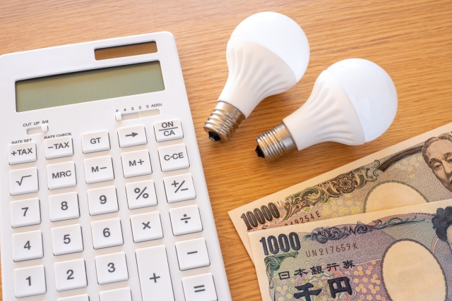

<!--
title: 完全分離二世帯の光熱費・メーターは分ける？費用分担の考え方｜おはぎの二世帯ぐらし
description: 完全分離の二世帯住宅で電気・ガス・水道のメーターを世帯ごとに分けるか、まとめて按分するか。世帯別契約と按分方式のメリット・デメリット、費用分担の決め方、新築の設計段階で確認したいポイントを中立的に整理します。
slug: 05-konetsuhi-meter-buntan
type: 解説（中立・三人称）
status: 下書き（公開前に人による最終チェック＝R-07）
公開前TODO:
  - サムネイル画像：images/05-konetsuhi-meter-buntan.jpg を採用済み（altは設定済み＝R-01）
  - 内部リンク：01記事・04記事とも実スラッグ済み（../01-kanzenbunri-nisetai-towa/ ・ ../04-kanzenbunri-tatewari-yokowari-hikaku/）
  - (アフィリエイトリンク) なし：実測項目の削除に伴い撤去済み。広告開示文は全記事必須のため冒頭に残す（R-05）。
-->

# 完全分離二世帯の光熱費・メーターは分ける？費用分担の考え方

二世帯住宅を完全分離にすると決めたあと、意外と後回しになりがちなのが「光熱費をどう分けるか」です。電気・ガス・水道のメーターを世帯ごとに分けるのか、それとも1つにまとめて後から按分するのか。ここを設計段階で決めておかないと、暮らし始めてから毎月の支払いでモヤモヤしたり、あとから割高な追加工事が必要になったりします。この記事では、完全分離二世帯の光熱費とメーターの分け方を、世帯別契約と按分方式の両面から整理します。

> 当ブログはアフィリエイト広告（Amazonアソシエイト・楽天アフィリエイト等）を利用しています。記事内のリンクから商品が購入されると、運営者が収益を得る場合があります。価格や在庫は変動するため、最新の情報は各販売ページでご確認ください。

## 光熱費は「分ける」か「まとめる」かの2択が基本

完全分離二世帯の光熱費の扱いは、大きく2つに分かれます。ひとつは電気・ガス・水道のメーターと契約を世帯ごとに分ける方法。もうひとつは1つの契約にまとめて、合計額を世帯で按分する方法です。

完全分離は構造的に世帯が独立しているため、メーターを分ける方式と相性が良い形です。一方で、初期費用や基本料金との兼ね合いから、あえてまとめて按分する家庭もあります。どちらにも一長一短があり、「公平さ」と「固定費・手間」のどこに重きを置くかで選び方が変わります。

## メーターを世帯ごとに分ける（世帯別契約）

電気・ガス・水道のそれぞれに世帯別のメーターを設け、各世帯が個別に契約する方法です。各世帯が使った分だけ自分で支払うので、毎月の精算という考え方自体が不要になります。

- **メリット**
  - 使った分だけ各世帯が負担するので、内訳が明確で不公平感が出にくい。
  - 毎月の精算やお金のやりとりが発生せず、「生活もお金も別々」という完全分離のメリットを保てる。
  - 将来どちらかの世帯を賃貸に出す・売却する・相続で分ける、といった場面でも扱いやすい。
- **デメリット**
  - メーターや引き込みの設置費が世帯の数だけかかる。
  - 基本料金が世帯数ぶん毎月発生し続け、片方の世帯が空き部屋になっても料金はかかり続ける。

引き込みやメーターの分離は、新築の設計段階でまとめて行うほうが割安になりやすく、住み始めてから分けようとすると割高だったり難しかったりします。分ける方針なら、早い段階で決めておくのが安全です。

## メーターをまとめて按分する（1契約を分担）

1つの契約・メーターでまとめ、請求された合計額を世帯で分け合う方法です。

- **メリット**
  - 基本料金が1契約分で済む。
  - 引き込みやメーターまわりの初期工事がシンプルで、初期費用を抑えやすい。
- **デメリット**
  - どちらの世帯がどれだけ使ったか内訳が見えにくく、分担割合でもめやすい。
  - 毎月精算しなければならない。

基本料金を二重に払わずに済むのが最大の利点ですが、その分「公平に分ける仕組み」を自分たちで用意する必要があります。

## 按分するときの分け方いろいろ

まとめて按分する場合、分け方にはいくつかのパターンがあります。

- **折半（均等割）**：合計を半分ずつ。シンプルだが、在宅時間や人数に差があると不公平に感じやすい。
- **人数割**：世帯の人数比で分ける。ただし乳児や在宅勤務など、人数だけでは実態とズレることもある。
- **定額**：一方が毎月固定額を入れる。分かりやすいが、季節による変動には弱い。
- **用途別ハイブリッド**：共有部は折半、専有部は別契約、というように組み合わせる。

完全分離でも、外灯・インターホン・宅配ボックス・共用のネット回線など「どちらの世帯のものとも言いにくい部分」は出てきます。この共有部をどう扱うかを先に決めておくと、後々のトラブルを避けることができます。

## 完全分離だからこそ意識したいこと

**独立性と将来の選択肢**：メーターを分けておくと、将来どちらかの世帯を賃貸に出す・売る・相続で分ける、といった場面で扱いやすくなります。完全分離の強みを活かしたいなら、世帯別の分離契約が無難です。

**「基本料金」という固定費**：メーターを分けると、基本料金が世帯数ぶん毎月かかり続けます。これは間取りや初期費用とは別に、暮らしている限りずっと続くランニングコストです。公平性を取るか、固定費を抑えるかのトレードオフになります。

**給湯・空調・太陽光の影響**：電気・ガス・エコキュートなど給湯方式や、太陽光・蓄電池の有無によって、光熱費の構造そのものが変わります。分け方を決める前提が変わるので、設備の方向性が固まってから設計するとブレません。

## 新築・設計の段階で決めておきたいチェック項目

- 引き込み・メーター分離は新築時のほうが割安。あとから分けるのは割高・困難なこともあるので、設計段階で方針を決める。
- 共有部（外灯・外構・インターホン・宅配ボックス・共用Wi-Fiなど）の電気・通信を、どちらの世帯に繋ぐか。
- 給湯方式が世帯で違う場合の契約をどうするか。
- 太陽光・蓄電池がある場合、発電分をどう配分するか。
- 世帯別メーターにできるかは地域・事業者で異なる。特に水道は分けられないこともあるので、対応できるプランか早めに確認する。

メーターや契約の条件は、物件・自治体・契約先によって変わります。最終的な可否や費用は、施工会社や各事業者に確認してから判断してください。

## 我が家の場合（これから決めるところ）

我が家は完全分離・縦割りの二世帯で、2026年8月の完成に向けて準備を進めているところです。光熱費とメーターの分け方も、この記事で整理したポイントをふまえて、設計の段階で方針を決めました。実際にどの方式にしたか、共有部をどう扱ったか、暮らし始めてからの精算はどうなったかは、住んでから追記していく予定です。

完全分離二世帯そのものの考え方は別記事「[完全分離二世帯とは](../01-kanzenbunri-nisetai-towa/)」で、間取りと初期費用の話は「[縦割り・横割りの間取りと費用感の比較](../04-kanzenbunri-tatewari-yokowari-hikaku/)」でまとめています。あわせて読むと、家づくり全体のお金の流れがつかみやすくなります。

## まとめ

完全分離二世帯の光熱費は、「世帯ごとに分ける」か「まとめて按分する」かが基本の選択肢です。独立性や将来の選択肢を重視するなら世帯別メーター、初期費用や基本料金を抑えたいなら按分、という整理ができます。

どちらを選ぶにしても、共有部の扱いと精算ルールを設計の段階で決めておくことが、住み始めてから後悔しないいちばんのコツです。

## 関連記事

- [完全分離の二世帯住宅とは｜メリット・デメリットを整理](../01-kanzenbunri-nisetai-towa/)
- [完全分離二世帯は縦割り？横割り？間取りと費用感を比較](../04-kanzenbunri-tatewari-yokowari-hikaku/)
- [二世帯の洗濯機・乾燥機の選び方](../03-sentakuki-kansouki-erabikata/)
